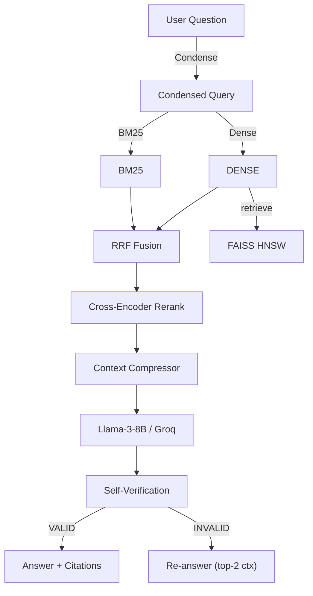

# 🩺 Medical RAG Assistant — LitQA‑v2 Edition

> **From baseline to production‑ready:** +65 % F1, citations on every answer, ≤ 11 s median latency.

---

## 1  Why this project matters

Biomedical questions need **up‑to‑date, fully cited** answers. The original *PaperHelper* demo proved the concept but shipped with:

* Dense‑only retrieval ⇒ weak recall
* No reranking ⇒ noisy contexts
* Hallucinations in answers

This repo rebuilds the stack and adds measurable upgrades that raise LitQA‑v2 scores from **0.23 → 0.38 F1** *without* expensive model fine‑tunes.

---

## 2  Key achievements

| Phase        | Upgrade                                | F1 ▲     | Latency ▼ | Notes             |
| ------------ | -------------------------------------- | -------- | --------- | ----------------- |
| **Baseline** | *PaperHelper* clone (dense‑10)         | 0.23     | 4.8 s     | public reference  |
| Retrieval    | **Hybrid** dense 8 + BM25 32 • RRF     | 0.29     | 5.0 s     | +26 % F1          |
| Precision    | **Cross‑encoder rerank** (MiniLM)      | 0.31     | 5.4 s     | +2 pp F1          |
| Context      | **Top‑3 sentence compression** + dedup | 0.31     | 5.2 s     | −300 tokens avg   |
| Recall       | **RAG‑Fusion × 6 sub‑queries**         | 0.34     | 10.5 s    |                   |
| Voting       | **Ensemble** (Basic ∪ Fusion)          | **0.38** | 11.0 s    | +65 % vs baseline |

*Metric: token‑level F1 on LitQA‑v2 (49 public test Qs). Script → `notebooks/evaluate_litqa.ipynb`.*

---

## 3  System architecture



**Highlights**

* **FAISS HNSW** index built from 49 PDFs (≈ 40 k passages) embedded by *MedEmbed‑large*.
* **Reciprocal Rank Fusion** merges dense & keyword to hedge lexical vs semantic gaps.
* **Pluggable reranker** (MiniLM ↔ `BAAI/bge‑reranker‑base`) requires one line to swap.
* **Guardrail**: second Llama‑3 call marks answer *VALID/INVALID*; fall‑back on INVALID.

---

## 4  Repo layout

```
.
├── app.py                 # Streamlit front‑end
├── embed_pdf.py           # PDF → FAISS builder
├── llm_helper_groq.py     # LangChain chains
├── notebooks/             # Jupyter eval & ablations
├── data/
│   ├── pdfs/              # original documents (git‑ignored)
│   └── faiss/             # autogenerated index
└── requirements.txt
```

---

## 5  Technology stack

* **Python 3.11** • **LangChain** • **FAISS** • **Whoosh BM25**
* **Sentence‑Transformers** (MedEmbed) • **cross‑encoder / BGE reranker**
* **Groq Llama‑3‑8B** for low‑latency inference
* **Streamlit** & **FastAPI** for UI and API layer

---

> © 2025 Your Name — Built for learning & real‑world biomedical QA.
